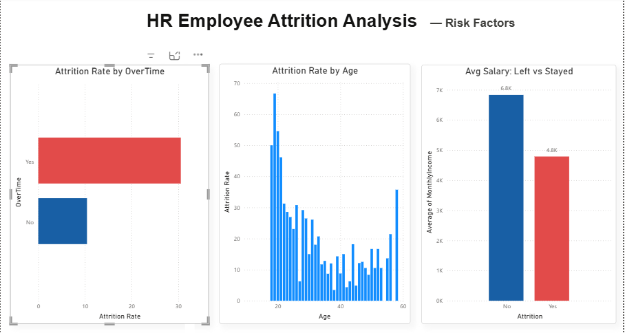
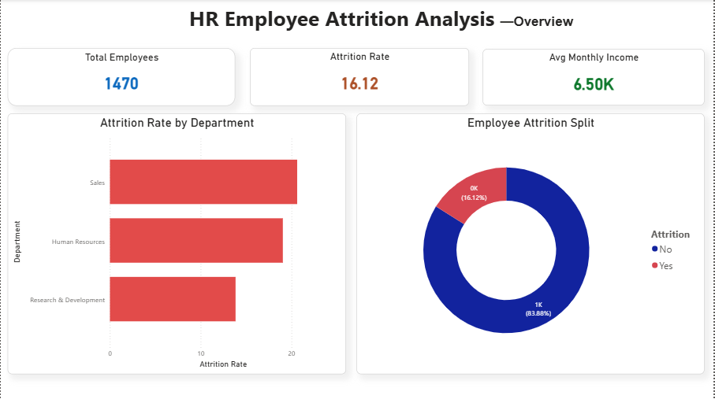

# hr-attrition-analysis
# HR Employee Attrition Analysis

## Project Overview
Analyzed IBM HR dataset of 1,470 employee records to identify 
key drivers of employee attrition using Python, SQL, and Power BI.
The goal was to provide actionable insights to help HR teams 
reduce employee turnover.

## Tools Used
- **Python** (Pandas, Matplotlib, Seaborn) — EDA & visualization
- **MySQL** — Data querying and analysis
- **Power BI** — Interactive dashboard

## Dataset
- Source: IBM HR Analytics Dataset (Kaggle)
- Records: 1,470 employees
- Features: 35 columns including age, salary, department, overtime

## Key Findings
1. **Overall attrition rate: 16.1%** — 237 out of 1,470 employees left
2. **Sales department** had the highest attrition at **20.63%**
3. **Overtime employees were 3x more likely to leave** — 30.5% vs 10.4%
4. Employees who left earned on average **₹2,045 less per month** (₹4,787 vs ₹6,832)
5. **Younger employees leave more** — avg age of leavers was 33.6 vs 37.6 for those who stayed

## Business Recommendations
- Reduce overtime workload especially in Sales department
- Review compensation structure for lower-income employees
- Build retention programs targeting employees aged 18–30

## Dashboard Screenshots

### Overview Page

### Risk Factors Page

## SQL Queries
Key queries used:
- Attrition rate by department
- Average salary comparison (left vs stayed)
- Overtime vs attrition analysis
- Top job roles with highest attrition
- Average tenure analysis

## How to Run
1. Clone this repository
2. Open `hr_analysis.ipynb` in Jupyter Notebook
3. Run all cells sequentially
4. Import `hr_attrition_clean.csv` into MySQL
5. Open Power BI and connect to the CSV file
